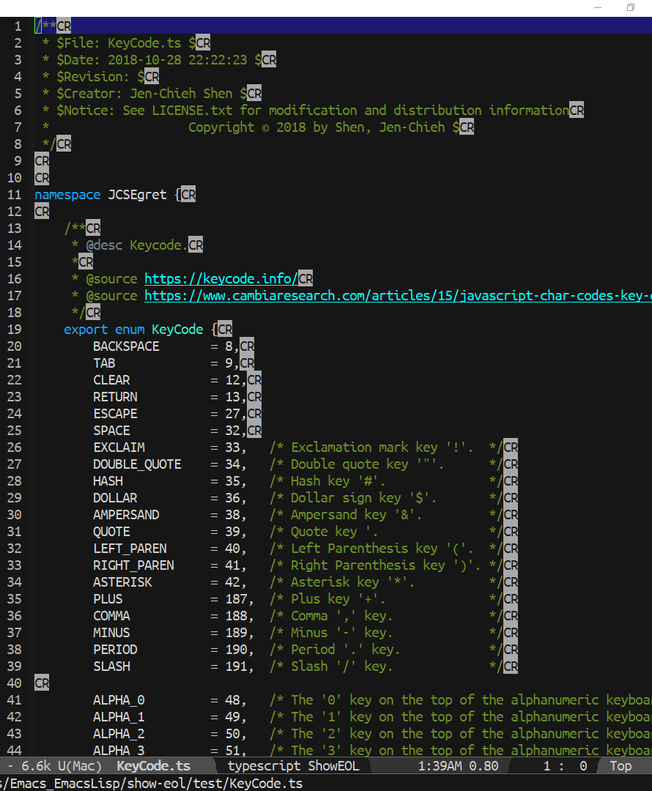

[](https://www.gnu.org/licenses/gpl-3.0)
[](https://melpa.org/#/show-eol)
[](https://stable.melpa.org/#/show-eol)

# show-eol
> Show end of line symbol in buffer.

[](https://github.com/jcs-elpa/show-eol/actions/workflows/test.yml)

| LF                               | CRLF                               | CR                               |
|:---------------------------------|:-----------------------------------|:---------------------------------|
||||

## Usage

Enable for all buffers.

```el
(global-show-eol-mode t)
```

Or you can just enable in specific buffer you want.

```el
(show-eol-mode t)
```

## Contribute

[](http://makeapullrequest.com)
[](https://github.com/bbatsov/emacs-lisp-style-guide)
[](https://www.paypal.me/jcs090218)

If you would like to contribute to this project, you may either
clone and make pull requests to this repository. Or you can
clone the project and establish your own branch of this tool.
Any methods are welcome!
